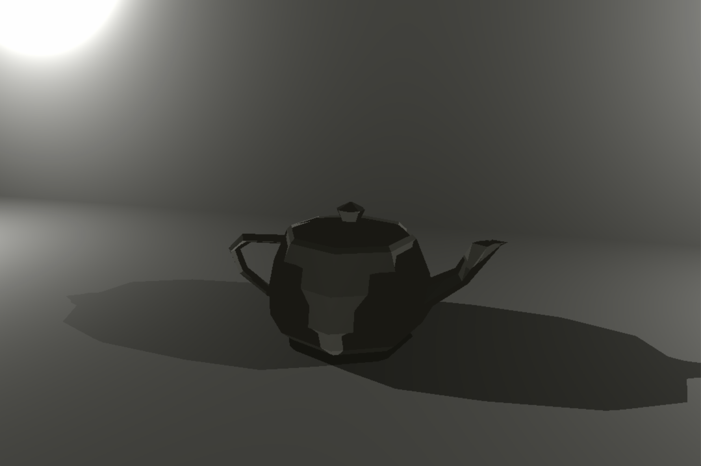
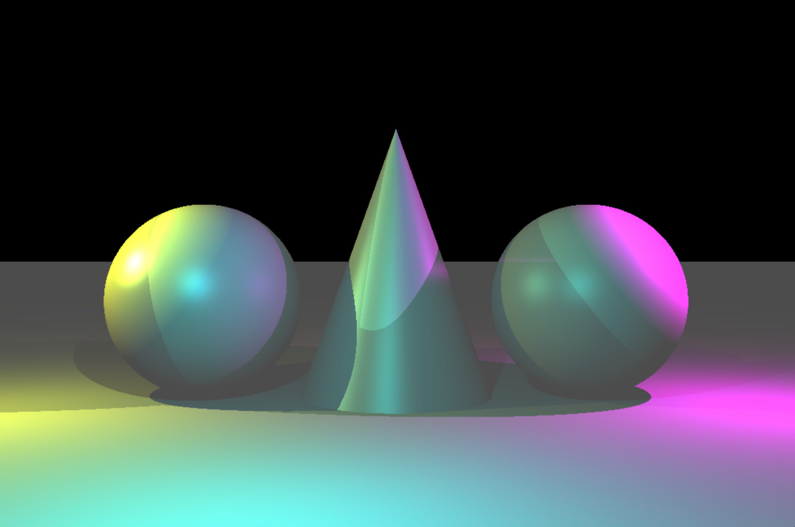
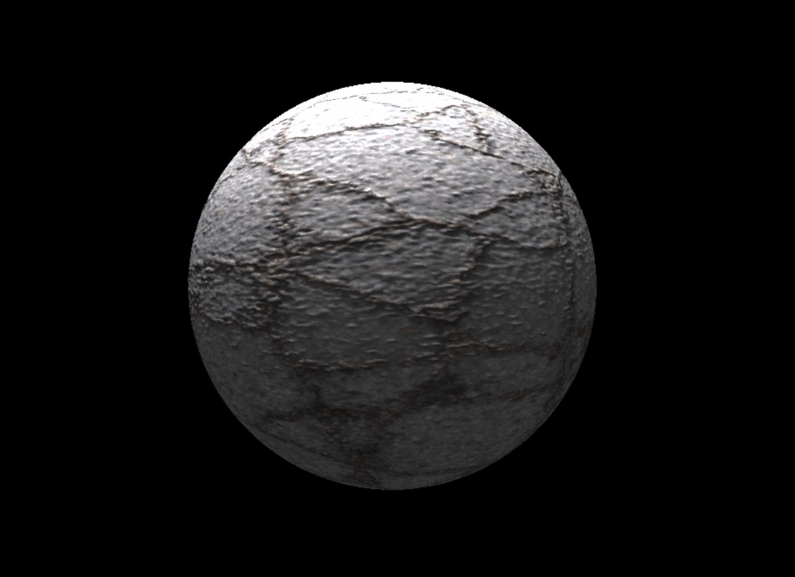
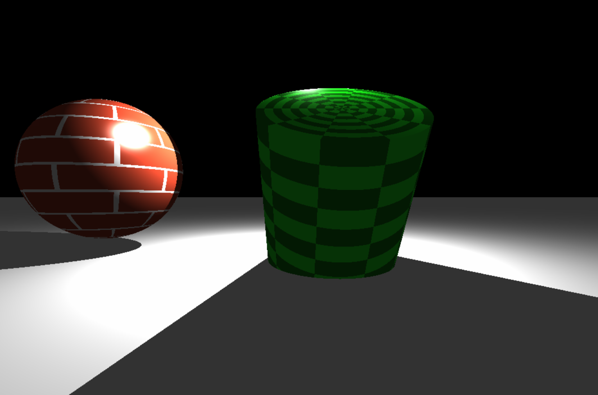
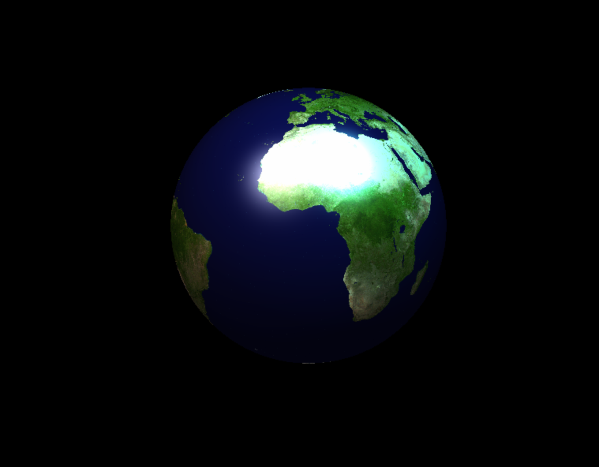
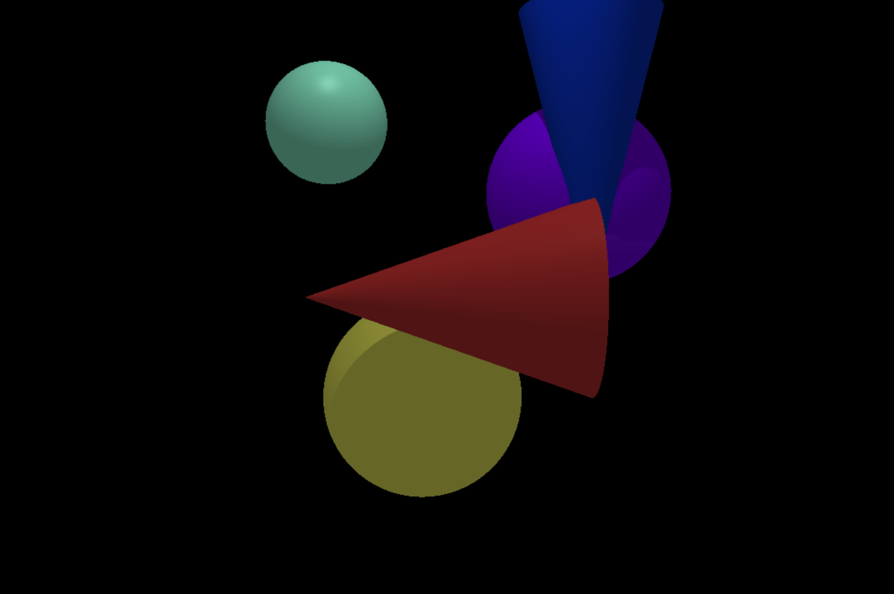

# MiniRT - Raytracing Image Generator
*This project was a group project. Co-creator:* [Sheree Morphett](https://github.com/ShereeMorphett)

## Description

MiniRT is a raytracing program written in C that generates computer-generated images representing scenes with simple geometric objects and their own lighting systems. The goal of this project is to familiarize developers with the Raytracing protocol and basic Computer Graphics concepts.
The program takes a scene description file with the ".rt" extension as its first argument, which defines various elements in the scene, such as ambient lighting, cameras, lights, spheres, planes, and cylinders. The images are displayed in a window using the miniLibX graphics library, and the program supports resizing and fluid window management.

 

## Implementation

### Soft Skills

This project was a team effort, and successful completion required effective GitHub management and issue solving. We effectively utilized GitHub to collaborate on the code, manage tasks, and track progress. Our communication skills played a crucial role in coordinating efforts and ensuring a smooth development process.

### Technical Skills

The implementation of MiniRT involved a variety of technical skills:

- **C Programming:** The entire project was implemented in the C programming language, adhering to the Norm guidelines provided.
- **Memory Management:** Careful memory allocation and deallocation were crucial to avoid memory leaks and unexpected program behavior.
- **MiniLibX:** We used the MiniLibX library to manage the window and display the generated images.
- **Raytracing Algorithm:** The core of the project involved implementing the raytracing algorithm to calculate intersections, handle reflections, shadows, and ambient lighting.
- **Parsing:** We developed a parser to read and interpret the scene description file in the ".rt" format.
- **Mathematics:** Mathematical calculations were essential for handling rotations, translations, and geometric properties of objects.
- **Phong Reflection Model:** As a bonus feature, we implemented the Phong reflection model, including specular reflection.
  
  

## Usage

To use MiniRT, simply run the compiled executable with a scene description file as its argument:

```bash
./miniRT scene.rt
```
```bash
./miniRT_bonus scene.rt
```

## Installation

To compile MiniRT, ensure you have the required libraries and run the provided Makefile:

```bash
make
```
This will generate the "miniRT" and "miniRT_bonus" executable, ready to be used.

 
